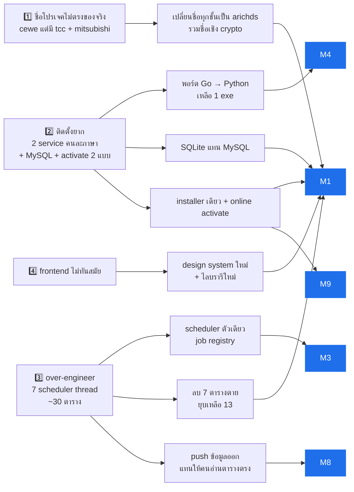
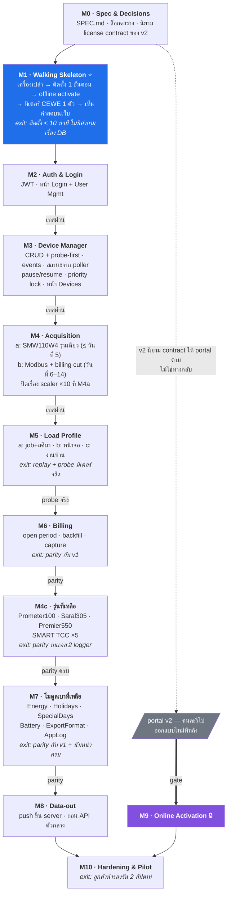
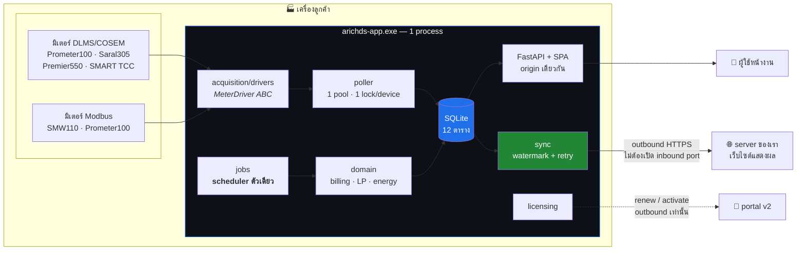
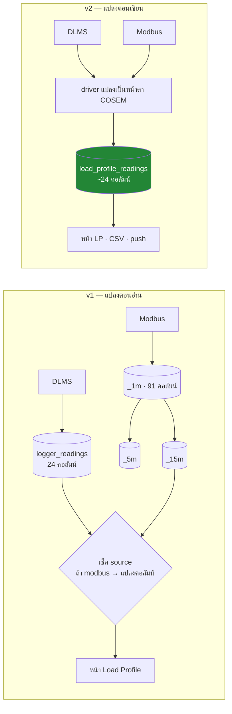

# ARICHDS Application v2 — แผนงาน Remake

> ร่างที่ 2 — 2026-08-02 (แก้หลัง `/scrutinize` + ข้อมูลเพิ่มจากเจ้าของโปรเจค)
> ต้นทาง: `C:\Users\HP\Documents\Work\cewe` (arichds-application v1)
> ขั้นถัดไป: `/grill-with-docs`

---

## 0. บริบทที่เปลี่ยนรูปแผน (อ่านก่อน)

สามข้อนี้ทำให้ร่างแรกต้องรื้อ:

1. **v1 ยังไม่เคยถูกใช้งานจริง — มีแค่ demo ให้ลูกค้าดู** → ไม่มีข้อมูล production, ไม่มี license ที่ออกไปแล้ว, ไม่ต้องเขียนสคริปต์ migrate, ไม่ต้อง maintain v1 คู่ขนาน, **เปลี่ยนชื่อเชิง cryptographic ได้ฟรี**
2. **แต่ business logic ผ่านหน้างานลูกค้าและลูกค้ายืนยันแล้ว** → กฎทางธุรกิจของ v1 คือ ground truth ห้ามคิดใหม่ ("ยังไม่ใช้งานจริง" กับ "ยังไม่พิสูจน์" คนละเรื่องกัน)
3. **มี API ของทีมเราเองบนเครื่องลูกค้า อ่าน database ของโปรแกรมโดยตรง เพื่อส่ง billing + load profile ไปแสดงบนเว็บไซต์** → นี่คือของที่ผูกกับ *ชื่อตาราง* ของเรา และเป็นตัวบล็อกการลีน database ตัวจริง (ดู §3.5)

---

## 0.5 แผนทั้งหมดในภาพเดียว

### จาก pain point → ทางแก้ → ลงที่ milestone ไหน



> S4 (design system) ลงที่ M0/M1 — จากนั้น**ทุกโมดูลทำหน้า FE ของตัวเอง**บนโครงนั้น ไม่มี milestone frontend แยก

> 🔑 **จุดที่ต้องเข้าใจ**: `S3C` (push ข้อมูลออก) ไม่ได้แก้แค่ pain point ข้อ 3 — มันคือ **เงื่อนไขที่ปลดล็อก `S3B` และ `S2B`**
> ตราบใดที่ยังมีคนอ่านตารางเราตรง ๆ จะเปลี่ยนชื่อตารางหรือเปลี่ยน database engine ไม่ได้เลย

### ลำดับงาน



> หลัง M1 ทุกลูกศรคือ **gate ด้วยเทส**: โมดูลหนึ่ง = BE + หน้า FE ของมัน + เทสผ่าน แล้วจึงเริ่มโมดูลถัดไป
> M1 ตั้งใจใช้ **offline activation** เพื่อไม่ให้ skeleton ถูกบล็อกด้วย portal ที่ยังไม่เริ่ม
> M9 คือ milestone เดียวที่พึ่งรีโปอื่น จึงถูกวางแยกออกมาไม่ให้ลาก M1–M8 ไปติดด้วย

### สถาปัตยกรรมตอนรัน



**สิ่งที่หายไปจากภาพนี้เทียบกับ v1**: MySQL service, ฐานข้อมูลตัวที่สองและสาม, `modbus-logger.exe`,
API ตัวกลางที่อ่านตารางเรา, หน้า Database Settings, scheduler อีก 6 thread

---

## 1. Baseline — v1 มีอะไรอยู่จริง

| ส่วน | ของจริงใน v1 |
|---|---|
| `cewe-worker/` (Python, DLMS/COSEM) | 130 ไฟล์ `.py`, ~29,000 บรรทัด |
| `modbus-logger/` (Go, Modbus) | 31 ไฟล์ `.go`, ~4,400 บรรทัด — คนละ service คนละ DB คนละวิธี activate |
| `cewe-fe/` (React 19 + AntD 6 + Tailwind) | 49 ไฟล์ `.ts/.tsx`, ~10,000 บรรทัด, 14 หน้า |
| Database | 19 ตาราง MySQL `cewe` + 5 ตาราง SQLite `auth.db` + 3 ตาราง/ยี่ห้อ MySQL `modbus_logger` |
| Migration | 24 revision (core) + Alembic แยก 2 ชุด (ชุด auth มี 0 revision) |
| Installer | 12 สคริปต์ `.ps1` + `.bat` คู่ทุกตัว + NSSM + MySQL portable zip ที่ต้อง trim เอง |
| Portal | `arichds-portal` แยกรีโป — **จะออกแบบใหม่ทั้งหมด** เพราะของเดิมอ้างอิง cewe |

### 1.1 หลักฐานของ over-engineering (ตรวจกับโค้ดจริงแล้ว)

**Scheduler แตกเป็น 7 thread โดยไม่จำเป็น** — `_DaemonScheduler` มี subclass 6 ตัว
(`battery_reader`, `billing_auto_reader`, `billing_backfill_scheduler`, `load_profile_scheduler`,
`modbus_billing_cut_scheduler`, `retention_scheduler`) + `LpCsvExporter` อีก 1
เริ่มทั้งหมดใน `background_worker.py:273-453` — ทุกตัวใช้ base class เดียวกัน แตก thread เพราะ "แยกโมดูล" ไม่ใช่เพราะต้องการ concurrency
รวม thread คงที่: main + BackgroundWorker + license-recheck + 7 scheduler + pool 1 thread/มิเตอร์

**7 ตารางที่ไม่มีใครใช้จริง**

5 ตัวแรกไม่เคยถูก *เขียน* เลย — ไม่มี `INSERT` หรือ constructor ที่ไหนนอก `models.py`
มีแค่ cascade delete (`devices/repository.py:424-434`) กับ retention purge (`worker/storage_service.py:117-119`):

`records_96` · `alarms` · `logger_exports` · `logger_confirmations` · `device_connection_log`

อีก 2 ตัวไม่เคยถูก *อ่าน* เลย — `permissions` และ `role_permissions` เพราะการตรวจสิทธิ์เป็นแค่การเทียบ string:
`api/dependencies.py:99` → `if current_user.role != role_name: raise 403` ไม่มีใครไปแตะตาราง permission เลย

> ⚠️ ร่างแรกเขียนว่า `energy_register_readings` ตายด้วย — **ผิด** `energy_summary/repository.py:76-101` อ่านจริง
> (นับพลาดเพราะ grep ชื่อตารางแทนชื่อคลาส `EnergyRegisterReading`)

**ตารางที่ทำงานทับกัน** — `device_status` vs `device_heartbeats` vs `device_connection_log` ·
`logger_readings` vs `records_96` vs `meter_readings_<brand>_1m` ·
`device_settings` vs `format_settings` vs `billing_settings` vs `lp_csv_export_state` (ทั้งหมดคือ "settings")

---

## 2. หลักการออกแบบ v2

1. **หนึ่ง process หนึ่ง binary หนึ่ง installer หนึ่ง license** — ไม่มี worker/logger คนละภาษาอีก
2. **หนึ่ง database** — จบ cross-DB (ADR 0004) และ dual-DB auth/core
3. **Lean by default** — ตาราง / thread / abstraction ต้องบอกได้ว่า *ใครอ่าน* ถึงมีสิทธิ์อยู่
4. **ข้อมูลออกทาง contract ไม่ใช่ทางตาราง** — ไม่มีใครนอกโปรแกรมแตะ schema ได้อีก
5. **Portal-first activation** — online เป็นทางหลัก, offline เป็นทางหนีไฟถาวร
6. **UI ทันสมัยแต่ professional** — density แบบเครื่องมือวิศวกรรม
7. **ผลลัพธ์ต้องตรงกับ v1** — internals เขียนใหม่ได้อิสระ แต่ตัวเลขที่ออกหน้าจอห้ามเปลี่ยน (§5)

---

## 3. สถาปัตยกรรมเป้าหมาย

```
arichds.exe  (Python 3.14 — floor >=3.13, PyInstaller onedir, 1 process)
├── api/            FastAPI — REST + เสิร์ฟ SPA จาก origin เดียวกัน
├── acquisition/    ชั้นเดียวสำหรับทุกยี่ห้อ/ทุก transport
│   ├── drivers/    MeterDriver ABC → dlms/* (Gurux), modbus/* (pymodbus)
│   ├── transport/  tcp / serial / gprs
│   └── poller/     1 ThreadPoolExecutor + 1 lock/device + manual-priority gate
├── jobs/           scheduler ตัวเดียว รัน periodic job ทุกตัวจาก registry
├── domain/         billing / load_profile / energy / devices / special_days / holidays
├── sync/           ⭐ ส่ง billing + LP ขึ้น server (ของใหม่ — §3.5)
├── licensing/      verify + enforcement + portal client
│   └── features    feature entitlement — .env FEATURES ∩ license features (§3.6)
└── db/             SQLite เดียว, Alembic ชุดเดียว
web/                React + AntD v6 (re-theme, D4) → static เสิร์ฟจาก api/
```

### 3.1 การรวม Modbus (pain point ข้อ 2)

DLMS ผูกกับ Gurux ซึ่งมีแต่ Python/.NET → ย้ายฝั่ง DLMS ไป Go ไม่ได้ ทิศทางเดียวที่คุ้มคือ
**พอร์ต `modbus-logger` (Go, 4.4k บรรทัด) → Python ด้วย `pymodbus`** แล้ววางไว้หลัง `MeterDriver` ตัวเดียวกัน

- ได้: 1 exe, 1 installer, 1 license, 1 DB, 1 หน้า config, ไม่มี cross-DB
- performance ไม่ใช่ประเด็น: modbus poll คงที่ 60 วิ (`config.go:28`), DLMS LP ทุก 900 วิ

**ต้นทุนจริงเล็กกว่าที่คิด** — 4,436 บรรทัดคือทั้งโปรเจค แต่ของที่ *ต้องพอร์ต* มีแค่ ~1/4:

| ต้องพอร์ต | บรรทัด | | ตายไปเลย (v2 มีของตัวเองแล้ว) | บรรทัด |
|---|---|---|---|---|
| `internal/meter` — register map + driver | 865 | | `cmd/logger/configui.go` — config UI ของตัวเอง | 1,017 |
| `internal/modbus` — transport | 141 | | `internal/storage` — v2 ใช้ SQLite/Python | 710 |
| `internal/poller` | 111 | | `internal/license` — v2 ใช้ของ worker | 463 |
| | | | `internal/config` | 213 |
| | | | `cmd/make-license` — portal ออกให้ *(แต่ก่อน M9 ยังต้องมี vendor CLI เซ็น license — ดู M1)* | 216 |
| | | | `cmd/logger/service.go` — NSSM wrapper | 204 |
| **รวม** | **~1,117** | | **รวม** | **~2,823** |

และใน 865 บรรทัดของ `meter` ส่วนใหญ่เป็น **ตารางข้อมูล** (register list) ที่แปลตรง ๆ ได้ ไม่ใช่ logic
- **งานแฝงที่ต้องไม่ลืม**: machine fingerprint ปัจจุบันคำนวณโดย `logger.exe` (`installer/windows/_lib.ps1:153,371`) — ลบ Go = ต้องเขียน fingerprint ใหม่ใน Python

### 3.2 Thread model (pain point ข้อ 3)

| v1 | v2 |
|---|---|
| main + BackgroundWorker + pool/device + **7 scheduler** + license-recheck | main (uvicorn) + **1 poller pool** + **1 scheduler thread** |
| ~10+ thread คงที่ | 2 thread คงที่ + n มิเตอร์ |

Job registry = ลิสต์เดียว `[(name, interval, fn)]` — เพิ่มงานใหม่ = เพิ่ม 1 บรรทัด ไม่ใช่ 1 ไฟล์ + 1 thread

#### ⚠️ กุญแจของ lock ต้องเป็น transport endpoint ไม่ใช่ `device_id`

v1 ล็อกด้วย `device_id` ล้วน ๆ (`connection_manager.py:171,193,221`, INV-SOCK-02 *"one connection at a time per meter"*)
— ถูกสำหรับ DLMS over TCP เพราะ 1 มิเตอร์ = 1 socket แต่ **ผิดทันทีที่หลายอุปกรณ์แชร์สายเส้นเดียว**

ฝั่ง Go จงใจทำเป็น per-bus sequential: `internal/poller/poller.go:1-3` — *"per-Bus polling loop: tick → for-each-slave …
**Serial per Bus per ADR-0008**"* เพราะ Modbus RTU หลาย slave อยู่บน COM port เดียวกันเป็นเรื่องปกติ

| transport | กุญแจของ lock |
|---|---|
| TCP / GPRS | `host:port` (ผลลัพธ์เท่ากับ `device_id` เดิมทุกประการ) |
| Serial (Modbus RTU **และ** DLMS-over-serial เช่น Mitsu SMW110) | **ชื่อ COM port** — ทุกอุปกรณ์บนพอร์ตเดียวกันเข้าคิวกัน |

> v1 มีช่องโหว่นี้อยู่แล้วสำหรับ DLMS-over-serial แค่ยังไม่โดนเพราะน่าจะมีมิเตอร์เดียวต่อพอร์ต
> พอ v2 รวม modbus เข้ามา การแชร์พอร์ตจะกลายเป็นเรื่องปกติ — ถ้าไม่แก้จะได้ frame ชนกันเป็นครั้งคราว reproduce ยากมาก

### 3.3 Database engine — SQLite

**เลือก SQLite** เพราะปลดล็อกงานติดตั้งได้มากที่สุด ของพวกนี้มีอยู่ใน v1 เพราะ MySQL ล้วน ๆ:

| ของที่หายไป | ที่อยู่ใน v1 |
|---|---|
| สคริปต์ bootstrap ฐานข้อมูล | `bootstrap-mysql.ps1` + `.bat` |
| แนบ MySQL portable ไปกับแพ็กเกจ | `installer/windows/vendor/` + ต้องรัน `trim-mysql-zip.ps1` ย่อ 85% ก่อนแพ็ก |
| ตรวจ MySQL เดิม / พอร์ต 3306 ชน | logic install-or-reuse detection |
| user 2 ตัว + grant คู่ `localhost`/`127.0.0.1` + SELECT ข้าม DB | ADR 0008 |
| service ตัวที่สองให้ start/stop/monitor | NSSM MySQL service |
| **หน้า Database Settings ทั้งหน้า** + `db_settings_service.py` + `/settings/database` + `/database/test` | ลูกค้าต้องกรอก host/port/user/pass |
| คู่มือ migration + `migrate.bat` | `docs/install/migration.md` |
| backup ด้วย `mysqldump` | → `VACUUM INTO` ไฟล์เดียว (เปิด WAL แล้วมี `.db`+`-wal`+`-shm` จึงคัดลอกดิบ ๆ ตอนโปรแกรมรันไม่ได้) |

**ปริมาณงานอยู่ห่างจากขีดจำกัดของ SQLite มาก**: modbus 1,440 แถว/วัน/มิเตอร์ + DLMS LP 96 แถว/วัน/มิเตอร์
→ **เคสแย่สุด (20 มิเตอร์ modbus ทั้งหมด)** 28,800 แถว/วัน ≈ 0.3 write/วินาที, retention 90 วัน
≈ 2.6 ล้านแถว ≈ 500 MB · ส่วนเคสที่คาดจริง (18 DLMS + 2 Modbus) อยู่ที่ 4,608 แถว/วัน — ดู §6.1

> **Poller ไม่ได้เพิ่มแถวเข้าตัวเลขพวกนี้เลย** (ADR 0007, M3-4) — tick พิสูจน์ว่ามิเตอร์ยังตอบอยู่
> แล้วทิ้งค่า ไม่เขียนอะไรลง DB · ตัวเลขทั้งสองชุดข้างบนนับเฉพาะ interval ที่ **มิเตอร์เป็นคนบันทึกเอง**
> ซึ่งเป็นสิ่งเดียวที่ `load_profile_readings` เก็บ

**ราคาที่ต้องจ่าย** (ห้ามตีเป็นศูนย์):
- `DELETE ... LIMIT` 4 จุด (`storage_service.py:117-122`) — `sqlite3` ที่มากับ CPython ไม่รองรับ ต้องเขียน retention ใหม่เป็น subquery
- `ON DUPLICATE KEY UPDATE` 11 จุด → `ON CONFLICT DO UPDATE`
- รวม MySQL-specific construct 38 จุด, raw `execute` 29 จุด
- เปิด WAL + คุมให้มีทางเขียนทางเดียว (poller หลาย thread + API อ่าน)

**เงื่อนไขที่จะทำให้ต้องกลับไป MySQL**: ถ้ามี process อื่นบนคนละเครื่องต้องต่อเข้ามาแบบ client-server
— ปัจจุบันไม่มี หลัง §3.5 ยิ่งไม่มี

### 3.4 ตาราง — ~30 → 13

| v2 | รวมมาจาก v1 |
|---|---|
| `devices` | `devices` + `device_settings` + `device_status` + `device_capture_objects` (→ JSON column) |
| `device_events` | `device_heartbeats` (+ แนวคิดจาก `alarms` / `device_connection_log` ที่ตายไปแล้ว) — **ไม่ใช่การพอร์ต 1:1**: v1 เขียนทุก tick, v2 เขียนเฉพาะตอนเปลี่ยนสถานะ + การกระทำของคน (ADR 0004) |
| `load_profile_readings` | `logger_readings` + `meter_readings_<brand>_1m/_5m/_15m` — **หน้าตา COSEM 12 คอลัมน์วัดค่า + `source` + `interval_sec`** (เคาะที่ grill M5 — เกณฑ์คือคอลัมน์ที่หน้าจอ v1 แสดงจริง) (D10, §6.1) · ชื่อเดิมตอน M1–M3 คือ `interval_readings` เปลี่ยนที่ M3-4 พร้อม ADR 0007 เมื่อแถว 60 วิหายไปแล้วเหลือ load profile ล้วน |
| ~~`interval_read_jobs`~~ **ตัดทิ้ง** | `load_profile_reads` — **ไม่พอร์ต** (ADR 0008, 2026-08-07): watermark มาจาก `MAX(read_at)` ของตารางข้อมูลเอง ตาราง job ที่เก็บ `read_end` ไว้ข้าง ๆ คือกับดักที่ v1 เหยียบมาแล้ว (over-report coverage 7 ชม. หลังแก้ timezone) · manual read-now เป็น synchronous ใต้ Transport Endpoint lock ตาม ADR 0006 |
| `billing_readings` | `billing_readings` |
| `billing_captures` | (เก็บเฉพาะถ้ายังต้องใช้ — `logger_exports`/`logger_confirmations` ตายแล้ว) |
| `energy_register_readings` | คงไว้ — **มีคนอ่านจริง** ห้ามยุบกับ `battery_readings` แบบมั่ว (คนละรูปทรง) |
| `battery_readings` | คงไว้ |
| `holidays` | `holidays` |
| `settings` (key/value) | `format_settings` + `billing_settings` + `lp_csv_export_state` |
| `users`, `user_tokens` | `users` + `user_tokens` — `role` เป็น enum column (`roles`/`permissions`/`role_permissions` **เป็นตารางตาย ไม่ใช่การยุบ** ดู §1.1) |
| `sync_state` | ⭐ ใหม่ — watermark ของ §3.5 |

**บัญชีที่ซื่อสัตย์**: v1 มีทั้งหมด ~30 ตาราง (19 core + 5 auth + 6 modbus จาก 2 ยี่ห้อ × 3 ช่วงเวลา)
ในนั้น **7 ตารางตายอยู่แล้ว** (§1.1) — ของที่มีชีวิตจริงคือ ~23 → 13 คือการลดเชิงออกแบบจริง
อย่าอ้างเลข 30 → 13 ตอนวัดผลโดยไม่บอกว่า 7 ตัวคือการลบของว่างเปล่า

- Alembic **ชุดเดียว** — และต้องตั้ง `render_as_batch=True` ใน `env.py` **ตั้งแต่ migration แรก** เพราะ SQLite ทำ
  `ALTER TABLE` drop/alter column ไม่ได้ ถ้าไม่ตั้งไว้ migration ที่แก้คอลัมน์จะต้อง rebuild ตารางมือทุกครั้ง
- ตัดทิ้ง: `records_96`, `alarms`, `logger_exports`, `logger_confirmations`, `device_connection_log`, aggregate `_5m`/`_15m` (คำนวณตอน query ได้)
- ชื่อ DB/ตาราง/env → `arichds` / `ARICHDS_*` ทั้งหมด **รวมถึงชื่อเชิง crypto** (fingerprint salt, signing version) เพราะยังไม่มี license ออกไป ถ้าไม่เปลี่ยนตอนนี้ = แบกชื่อ `CEWE` ไปตลอดชีวิตโปรเจค

### 3.5 ⭐ Data-out — ปิดหนี้ ADR 0006

**สถานะปัจจุบัน**: ทีมเราเขียน API ไว้บนเครื่องลูกค้า อ่าน `billing` + `load profile` จากตารางตรง ๆ แล้วส่งขึ้น server เพื่อแสดงบนเว็บไซต์

`billing/docs/adr/0006-external-api-webhook-deferred.md` เลื่อนงานนี้ออกไปด้วยเหตุผล *"ยังไม่มี 3rd party caller จริง"*
แล้วเขียนผลเสียไว้เองว่า *"ถ้า 3rd party requirement มาฉุกเฉิน — ต้อง retrofit public contract บน internal endpoint"*
— สิ่งที่เกิดขึ้นจริงคือมีคนไปเจาะฐานข้อมูลเอง เพราะเราไม่มีทางออกให้ และหน้า `ApiConfig` ใน FE ก็มี mockup ของ Open API + Webhook รออยู่แล้ว

**v2 ทำ push** (ไม่ใช่ pull) — โปรแกรมส่งข้อมูลขึ้น server เอง:

- ตัด API ตัวกลางบนเครื่องลูกค้าทิ้ง → **ของที่ต้องติดตั้งน้อยลงอีก 1 ชิ้น** (pain point ข้อ 2)
- ใช้ outbound HTTPS ทางเดียว ไม่ต้องเปิด inbound port/firewall เข้าเครื่องลูกค้า — สมมติฐานเดียวกับ license renewal ที่ยังไงก็ต้องมี
- ปลด schema เป็นเรื่องภายใน → §3.4 ทำได้จริง และ §3.3 เลือก engine ได้อิสระ

**Contract (D9)**: **JSON · ทุก 15 นาที · JWT** — จังหวะตรงกับรอบ load profile พอดี ส่งได้ทันทีที่มีแถวใหม่

**รูปร่าง**: `sync_state` เก็บ watermark ต่อ device/ต่อชนิดข้อมูล (แพตเทิร์นเดียวกับ `lp_csv_export_state` ที่ v1 มีอยู่แล้ว)
→ batch แถวใหม่ตั้งแต่ watermark → POST JSON พร้อม JWT → server ACK → เลื่อน watermark
ต้องทนเน็ตหลุด (retry + ส่งย้อนหลังได้) เพราะหน้างานเน็ตไม่นิ่ง — watermark เลื่อนเมื่อ ACK เท่านั้น

**⚠️ billing ใช้ watermark แบบ "แถวใหม่" ไม่ได้** — สองชนิดข้อมูลนี้พฤติกรรมต่างกัน:

| ชนิด | พฤติกรรม | วิธี sync |
|---|---|---|
| `load_profile_readings` | append-only | watermark ตาม rowid/`read_at` ตรง ๆ |
| `billing_readings` | **ไม่ append-only** — open period คือแถวเดียวที่ถูก upsert ซ้ำในที่เดิม (ADR 0018) และ backfill แทรกแถว `bill_date` *เก่ากว่า* watermark (ADR 0012) | track ด้วย `updated_at` หรือส่ง open slot ซ้ำทุกรอบ ให้ server upsert ด้วย key `(device, bill_date)` |

> ถ้าใช้ watermark เดียวกันหมด: เว็บไซต์จะไม่เห็นบิลงวดปัจจุบันขยับ และไม่เห็นประวัติที่ backfill — โดยที่ sync ไม่ error เลย

> เพราะ `load_profile_readings` เก็บหน้าตา COSEM อยู่แล้ว (§6.1) payload จึงเป็นการ serialize แถวตรง ๆ ไม่ต้อง pivot

**ข้อมูลประกอบที่เพิ่งพบ**: v1 มี M2M auth แบบ `X-API-Key` อยู่แล้วบนเกือบทุก router
(`api/dependencies.py:143,174` ใช้ใน `devices`, `billing`, `load_profile`, `energy_summary`, `fs`, `holidays`, `settings`, `battery`)
— แปลว่า API ตัวกลาง **เรียก API ได้ตั้งแต่แรก** แต่เลือกไปอ่านตารางแทน
→ ต้องตัดสินแยกอีกข้อ: **ขา inbound ของ v2 จะเก็บ `X-API-Key` ไว้ไหม** (คนละทิศกับ JWT ของขา push)

### 3.6 Feature entitlement — อย่าให้ตกหล่น

v1 มีกลไกขายแยกฟีเจอร์อยู่แล้วและ **ใช้งานจริง**: `require_feature()` ที่ระดับ router (`billing/router.py:77`,
`battery/router.py:31`) และระดับ endpoint (`billing/router.py:371` → `billing_excel_export`)
ชุดที่เปิดใช้ = `.env FEATURES ∩ license features` (`features.py`, ADR 0011 amends 0001)

นี่คือกลไกที่ทำให้ **ขายฟีเจอร์แยกกันได้** จึงต้องอยู่ใน v2 ตั้งแต่ต้น และต้องเป็นส่วนหนึ่งของ
**สัญญา license ที่ M0 นิยามให้ portal v2 ทำตาม** — ไม่ใช่ของที่ค่อยแปะทีหลัง

---

## 4. Roadmap — walking skeleton ก่อน แล้วไต่ทีละโมดูล

> ร่างแรกวางความเสี่ยงหนักที่สุด (packaging + activation = pain point ข้อ 2 ทั้งดุ้น) ไว้ท้ายสุด
> และส่งมอบค่าได้ที่ milestone สุดท้ายเท่านั้น — รื้อลำดับใหม่ให้แตะทุกรอยต่อเสี่ยงตั้งแต่ก้อนแรก

> 📅 **Timeline (จาก SPEC.md, M0 grilling 2026-08-03 · แก้ขอบเขต M4a 2026-08-07)**:
> **วันที่ 5 = M1–M6 ครบ** โดย M4a นับเฉพาะ **SMW110W4 รุ่นเดียว** — รุ่นที่เหลือย้ายไป **M4c หลัง M6**
> (เจ้าของตัดสิน: เจาะรุ่นเดียวให้ทะลุถึง billing ก่อนขยายทางกว้าง) · เส้นทาง Modbus
> (พอร์ต Go + modbus billing cut + §6.1 ฝั่งเขียน) ยังอยู่ช่วง **วันที่ 6–14** พร้อม M7–M8 ·
> **วันที่ 14 = M8 จบ** (push ขึ้นเว็บ + ถอน API ตัวกลาง) · M9 รอ portal v2
>
> ⚠️ **"มิเตอร์จริงมีครบ 3 ยี่ห้อตลอดช่วง" ไม่จริงแล้ว** — ทดสอบ 2026-08-07: CEWE ทั้งสามต่อได้
> จากเครื่องพัฒนา แต่ **SMART TCC `203.170.148.103:4059` timeout** และ SMW110W4 เข้าถึงได้เฉพาะ
> ผ่านเครื่องลูกค้า (ตัว TCP อยู่บน LAN `192.168.1.31` ยิงจากข้างนอกไม่ได้) ⇒ exit ที่ต้องใช้
> "อ่านมิเตอร์จริง" ต้องนัดเวลากับลูกค้า ไม่ใช่ของที่หยิบใช้เมื่อไหร่ก็ได้

### 🧪 กติกาการเดิน — ทีละโมดูล gate ด้วยเทส

หลัง M1 เป็นต้นไป **หนึ่ง milestone = หนึ่งโมดูลจบในตัว** (backend + หน้า FE ของมัน + เทส)
เทสผ่านแล้วจึงเริ่มโมดูลถัดไป — **ไม่มี "milestone frontend แยก" อีก** design system ถูกเลือกที่ M0
(mockup เทียบไลบรารี) และวางโครงที่ M1 จากนั้นทุกโมดูลทำหน้าของตัวเองบนโครงนั้น

นิยาม **"เทสผ่าน"** ต่อโมดูล:

| เกณฑ์ | ใช้กับ |
|---|---|
| `ruff format` + `ruff check` + `pytest` ของโมดูลผ่าน (เขียนแบบ `/tdd`) | ทุกโมดูล |
| `pnpm lint` + `pnpm build` ผ่าน | ทุกโมดูลที่มีหน้า FE |
| **Output parity** — ตัวเลขตรงกับ v1 บนมิเตอร์/ข้อมูลเดียวกัน (§5) | โมดูล domain: LP · Billing · Energy |
| อ่านมิเตอร์จริงสำเร็จ | โมดูล acquisition |

ข้อยกเว้นเดียว: **M1 skeleton ต้องมาก่อนบันไดโมดูล** — ถ้าเริ่มที่ login บนรีโปเปล่า
ความเสี่ยง installer/packaging จะไหลกลับไปอยู่ท้ายแผนเหมือนร่างแรกทันที

### M0 — Spec & decisions
เขียน `SPEC.md` (`/create-spec`) · ยกเฉพาะ ADR ที่ยังเป็นจริงจาก v1
(0011 lease model, 0018 open period, 0020 manual gate, 0016 holiday/TOU — ที่เหลือปล่อยตายไปกับ v1
ส่วน **0019 modbus cut ต้องเขียนใหม่** เพราะฐานข้อมูลที่มันอ้างถึงหายไป ดู §5)

งานที่ต้องเสร็จในนี้ด้วย:
- ~~mockup หน้า Devices เทียบไลบรารี~~ ✅ ตัดสินแล้ว: **AntD v6 re-theme** (D4)
- **ยืนยัน mapping modbus → COSEM กับลูกค้า** (§6.1 ข้อ 2) — gate ของ M4b เท่านั้น ไม่ block 5 วันแรก

**Exit**: SPEC ผ่าน · ตาราง v2 ล็อก · **normalization contract (§6.1) เขียนครบทั้งเวลา/หน่วย/ชื่อคอลัมน์** ·
เลือกไลบรารี FE แล้ว · mapping ยืนยันแล้ว · สัญญา license ของ v2 นิยามเสร็จ **พร้อม feature set (§3.6)**

### M1 — Walking skeleton ⭐
> เครื่อง Windows เปล่า → รัน **installer exe ตัวเดียว** (D3) → ใส่ **activation code แบบ offline** → เพิ่มมิเตอร์ CEWE 1 ตัว → เห็นค่าอ่านสดบนหน้าเว็บ

ก้อนเดียวนี้แตะทุกรอยต่อที่เสี่ยงจริง: installer, SQLite + Alembic (batch mode), license verify + enforcement +
fingerprint (เขียนใหม่ใน Python), poller, FastAPI, FE, one-origin serving — ตั้งแต่สัปดาห์แรก ไม่ใช่เดือนที่ 6

> ⚠️ **ตั้งใจใช้ offline ที่ M1** — online activation ต้องมี endpoint `/activate` ที่มีชีวิต แต่ portal v2 ยังไม่เริ่ม
> ถ้าผูก M1 กับ online = skeleton ที่ควรลดความเสี่ยงกลับถูกบล็อกด้วย dependency ข้ามรีโป
> offline code ยังไงก็ต้องมีเป็นทางหนีไฟถาวรอยู่แล้ว จึงพิสูจน์ packaging + enforcement ได้ครบโดยไม่ต้องรอใคร

งานที่ซ่อนอยู่ใน M1 — พูดตรง ๆ กันประเมินเบาเกิน:
- **vendor CLI เซ็น license** — offline activation ต้องมีคนเซ็น แต่ portal v2 มาที่ M9 → ยก `tools/generate_key.py` +
  `generate_keypair.py` จาก v1 มาเปลี่ยนชื่อ (ของมีอยู่แล้ว งานน้อย แต่ถ้าลืม M1 ติดตั้งไม่จบจริง)
- **"เห็นค่าอ่านสด" ดึง Gurux DLMS stack ทั้งชุดเข้า M1 โดยปริยาย** — รับได้เพราะเป็นการ *copy* จาก v1
  ไม่ใช่เขียนใหม่ (§5) แต่งานคือ integration ไม่ใช่ development — M1 ไม่ใช่ milestone เบา มันเบาแค่ "ต่อฟีเจอร์"

**Exit**: จับเวลาติดตั้งบนเครื่องเปล่า < 10 นาที โดยไม่ต้องตอบคำถามเรื่องฐานข้อมูลเลยสักข้อ

> **M1 ไม่มี auth โดยเจตนา** — หน้าเว็บเปิดโล่ง ไม่มี login เพื่อไม่ลากโมดูล M2 เข้ามาใน skeleton
> M2 คือคนติด guard ย้อนหลังลง endpoint ทุกตัวที่ M1 สร้าง (งานชิ้นหนึ่งของ M2 ไม่ใช่ของแถม)

### M2 — Auth & Login ✅ *(เสร็จ 2026-08-05 — commit `026bd8e` + `7b75a3a`)*
`users` + `user_tokens` + role เป็น enum column (§1.1 — ไม่มีตาราง roles/permissions อีก) · JWT ·
**ติด auth guard ลง endpoint ทั้งหมดที่ M1 เปิดโล่งไว้** · หน้า Login + User Management (สองหน้าแรกที่ใช้ design system จริง)
**Exit**: login/logout/จัดการ user ครบผ่าน UI · ไม่มี endpoint ไหนเข้าได้โดยไม่ authenticate + เทสผ่าน
→ ทำได้ครบ: เทส 313 ตัว · route-table sweep กันไม่ให้ router ใหม่หลุด guard · กฎกันล็อกตัวเอง 3 ข้อ
(v1 ไม่มีเลยสักข้อ — ดู `.claude/run-logs/issue-2.md`)

### M3 — Device Manager *(grill 2026-08-05 — 31 ข้อตัดสิน ดู SPEC §3.3)*
device CRUD ครบฟิลด์ v1 (devices ตารางรวม §3.4) · **probe-first identity** — อ่าน `meter_serial`
จากมิเตอร์ก่อนเขียนแถว probe ล้ม = ไม่สร้าง (ADR 0005) · `device_events` เฉพาะตอนเปลี่ยน ·
**ไม่มี health-check loop** — สถานะมาจากผล Poller ที่เดินอยู่แล้ว (ADR 0004 — job registry ไม่ได้ job แรกที่นี่) ·
pause/resume คอลัมน์เดียว (เจตนา ADR 0009 ของ v1 คงไว้ครบ) · **priority lock** ให้คำสั่งคนมาก่อน
background (ADR 0006 — ยกจาก ADR 0020 ของ v1 มาเร็วขึ้น 1 milestone) · quota นับจำนวนจาก license ·
**ถอดรุ่น SIM ออกจากตัวสินค้า** เหลือ fake driver ในเทส · หน้า Devices เต็มรูป (tree + form ตาม v1)
**Exit**: เพิ่ม/แก้/หยุด/ลบมิเตอร์ CEWE จริงได้ผ่าน UI · เห็นสถานะ Online/Offline ถูกต้อง ·
Read now / Test connection ได้คิวก่อน poller + เทสผ่าน
*(หน้า Instantaneous เคยอยู่ที่นี่ — ย้ายไป M5 ในชื่อ **Records** เพราะของจริง v1 คือตารางนับความครบ
ของ interval ไม่ใช่หน้าอ่านค่าสด และต้องมี load profile ก่อนจึงมีอะไรให้นับ)*

### M4 — Acquisition — สามเฟส *(แก้ลำดับ 2026-08-07 — ดูกล่องด้านล่าง)*

> **⚠️ เปลี่ยนลำดับจากร่างเดิม (เจ้าของตัดสิน 2026-08-07)**
> ร่างเดิมให้ทำ **ทุกรุ่น** ให้จบใน M4a ก่อนขึ้น M5 · ของใหม่คือ **เจาะรุ่นเดียวให้ทะลุถึง billing ก่อน
> แล้วค่อยขยายออกทางกว้าง** — SMW110W4 เดินตลอดเส้น M4a → M5 → M6 ส่วนรุ่นที่เหลือทั้งหมด
> (รวม Prometer100) ไปอยู่ M4c หลัง M6 จบ
>
> **เหตุผลที่เลือกรุ่นนี้เป็นตัวเจาะ**: 2026-08-07 เป็นรุ่นเดียวที่มีข้อมูลภาคสนามครบทั้งเส้น —
> capture objects, ลำดับ entry, บริการอ่านที่มิเตอร์ยอมรับ, และเพดานคอลัมน์ของ billing
> (ดู [`meter-notes/smw110w4-scan.md`](meter-notes/smw110w4-scan.md)) และมันเป็นรุ่นที่บังคับให้
> abstraction ถูกตั้งแต่แรก เพราะมันหักสมมติฐานสามข้อที่รุ่นอื่นซ่อนไว้ (transport ไม่ผูกกับรุ่น ·
> byEntry เท่านั้น · billing อ่านได้แค่ prefix)
>
> **ราคาที่จ่ายและต้องรู้ตัว — ไม่ใช่ข้อโต้แย้ง เป็นข้อเท็จจริงที่ต้องไม่ลืม**:
> SMW110W4 **ไม่มี Logger 2** ⇒ ดีไซน์ `logger_id` ของ SPEC §3.5 (unique key
> `(device_id, logger_id, read_at)`) **จะไม่ถูกทดสอบเลยจนถึง M4c** และ **exit "parity" ของ M5/M6
> จะพิสูจน์บนรุ่นเดียว** · เคสที่ยังไม่ถูกแตะคือ Prometer 100 (Logger 1 = 900 วิ แต่ Logger 2 = **300 วิ**)
> และ Premier 550 (คาบเท่ากันแต่คอลัมน์ชนกัน) — ทั้งคู่บันทึกไว้ใน
> [`meter-notes/load-profile-capture-objects.md`](meter-notes/load-profile-capture-objects.md)
> ⇒ **M4c ต้องถือว่า parity ยังไม่ผ่านจนกว่าสองเคสนี้จะเดินจริง**

**M4a (ภายในวันที่ 5) — SMW110W4 รุ่นเดียว ทั้ง DLMS serial และ TCP**:
driver + serial transport (`ConnectionParams.serial()`) ·
manual-priority gate (ADR 0020) · ปิดเรื่อง scaler (§5)
**Exit**: อ่าน SMW110W4 จริงได้ทั้งสอง transport ลงตาราง `load_profile_readings`

> ✅ **โค้ดของ M4a ลงครบแล้ว (2026-08-07)** — issue #9 (`ConnectionParams.serial()` ·
> `Smw110Driver` · catalog เลิกผูก transport กับรุ่น · **แก้ `endpoint` ที่คืน `"None:None"`
> ให้ serial** ซึ่งทำให้ Poller กับ Manual Read จับคนละ lock บน COM port เดียว — ADR 0006
> เป็นโมฆะเงียบ ๆ) และ issue #10 (`read_load_profile()` · entry window · scaler ยืมจาก
> sibling ที่หน่วยตรงกัน · `InstantaneousReading` → `IntervalReading`)
>
> **แต่ Exit ยังไม่ปิด** — ทั้งสองใบทดสอบบน fake ทั้งหมด เพราะเครื่องจริงเข้าถึงไม่ได้จาก
> เครื่องพัฒนา (TCP อยู่หลัง LAN ลูกค้า · serial เป็น COM port บนเครื่องเขา)
> **การอ่านมิเตอร์จริงทั้งสอง transport เป็นงานของเจ้าของโปรเจกต์ ต้องนัดกับลูกค้า**
> และการเขียนลงตาราง `load_profile_readings` เป็นของ M5

> **รุ่นนี้ไม่ใช่ serial-only** — ร่างเดิมเขียนว่า "SMW110-serial" ซึ่งพิสูจน์แล้วว่าผิด:
> ไซต์ลูกค้ามีสองเครื่องรุ่นเดียวกัน เครื่องหนึ่งต่อ `COM4` อีกเครื่องต่อ `192.168.1.31:4059`
> ⇒ **transport เป็นคุณสมบัติของการติดตั้ง ไม่ใช่ของรุ่น** และ `catalog.py` ที่ตั้ง
> `supports_serial=True` / `default_port=None` ต่อรุ่นต้องเลิกผูกแบบนั้น

**M4c (หลัง M6 จบ) — รุ่นที่เหลือทั้งหมด**:
Prometer100 (driver มีแล้วจาก M1 — ต้องเดินผ่าน LP/billing จริง) · Saral305 · Premier550 ·
SMART TCC ×5 · **ช่องกรอก `block_cipher_key` / `authentication_key`** (เลื่อนจาก M3 → M4 → มาที่นี่
2026-08-07 เพราะรุ่นเดียวที่ใช้คีย์คือ TCC ซึ่งอยู่เฟสนี้ — และต้องตัดสินก่อนว่าจำเป็นไหม ดู SPEC §3.3)
**Exit**: อ่านครบ 3 ยี่ห้อ **และ** parity ผ่านบนเคส 2 logger ที่ M5 ยังไม่ได้แตะ

> 🔴 **SMART TCC คือความเสี่ยงตัวจริงของเฟสนี้ ไม่ใช่ Mitsubishi** — 5 จาก 9 รุ่นเป็น TCC,
> เอกสารสแกนยังไม่ครบ (`tcc-obis-scan-partial.md` ไม่เคยเห็นกลุ่ม ProfileGeneric เลย)
> และ `203.170.148.103:4059` **ต่อไม่ได้** (timeout, ทดสอบ 2026-08-07)
> ⇒ ต้องตามเรื่องลิงก์ตั้งแต่ก่อนถึงเฟสนี้ ไม่ใช่ตอนเริ่มทำ

**M4b (วันที่ 6–14) — เส้นทาง Modbus** *(gate: mapping — เดินด้วย DERIVED ของ ADR 0005 ระหว่างรอลูกค้ายืนยัน)*:
SMW110 / Prometer100 พอร์ตจาก Go **พร้อม map register → COSEM ตอนเขียน** (§6.1) + modbus billing cut (ADR ใหม่)
**Exit**: มิเตอร์ modbus ลงตารางเดียวกับ DLMS หน่วย/เวลา normalize ถูกต้อง

### M5 — Load Profile
**แตกเป็นสามเฟส** (grill 2026-08-07 — รายละเอียดที่เคาะแล้วทั้ง 10 ข้ออยู่ใน `SPEC.md` §3.5):

- **M5a** — migration (`logger_id` · `interval_sec` · unique key) · **scheduler thread + job registry
  (ยังไม่มีในโค้ดเลย — M5 เป็นโมดูลแรกที่ต้องการ และ M6/M7/M8 จะใช้ต่อ)** · LP job
  **Exit**: replay parity จาก buffer ที่บันทึกไว้ + **probe ยืนยันบนมิเตอร์จริงทั้งสองเครื่อง**
- **M5b** — หน้า Load Profile (**ดูอย่างเดียว** — ช่วงวันที่บังคับ, แบ่งหน้าฝั่งเซิร์ฟเวอร์) ·
  หน้า Records · ปุ่มดึงย้อนหลัง
  **Exit**: เลขบนจอตรงกับในตาราง
- **M5c** — retention · backup รายวัน (`VACUUM INTO` + หมุนเวียนลบ)
  **Exit**: job รันจริง ลบ/สำรองถูกต้อง

> **CSV auto-export ย้ายไป M7** — รูปแบบไฟล์เป็นค่าที่ผู้ใช้ตั้งได้ และหน้า ExportFormat
> เจ้าของค่านั้นอยู่ที่ M7 อยู่แล้ว ⇒ ฟีเจอร์ไปอยู่กับหน้าตั้งค่าของมัน แลกกับการที่ลูกค้า
> ไม่มี CSV จนถึง M7 · ผลพลอยได้คือ M5c เหลืองานเบื้องหลังล้วน และ M5b จบในตัวไม่มีปุ่มค้าง

> **Exit ของ M5 ไม่ใช่ parity เทียบ v1 อีกต่อไป** — v1 ฮาร์ดโค้ด client address **5**
> (`cewe/cewe-worker/src/drivers/smw110.py:119`) ส่วน SMW110W4 ทั้งสองเครื่องตอบเฉพาะ **6**
> ⇒ **v1 ต่อมิเตอร์รุ่นที่ M4a/M5 ครอบไม่ติดเลย** ไม่มี output ให้เทียบ ต่อให้รีโมทเข้าเครื่องลูกค้าได้
> **parity ย้ายไปเป็น exit ของ M4c** ซึ่ง CEWE ทั้งสามรุ่นเดินจริงและต่อได้จากเครื่องพัฒนา
>
> นี่คือผลข้างเคียงของการแคบ M4a เหลือรุ่นเดียวเมื่อ 2026-08-07 ที่ไม่มีใครพูดถึงตอนนั้น:
> **รุ่นเดียวที่ M5 ครอบ คือรุ่นเดียวที่พิสูจน์ parity ไม่ได้ ส่วนรุ่นที่พิสูจน์ได้ทั้งสามถูกเลื่อนไป M4c**

> ⚠️ **SMW110W4 ไม่มี Logger 2** — ยืนยันซ้ำสองรอบด้วย probe เมื่อ 2026-08-07
> (`1.0.99.2.0.255` → *"undefined object"* ทั้งสองเครื่อง) ⇒ โค้ด `logger_id` เขียนได้แต่
> **เดินจริงไม่ได้จนถึง M4c** · เขียนให้รองรับสองเคสตั้งแต่แรกและปักเทสไว้ด้วย fake driver
> แต่ **อย่านับว่าเคสสอง logger ผ่าน** จนกว่า Prometer 100 (900/300 วิ ⇒ ครบวัน 96 กับ 288
> คนละเลข) และ Premier 550 (คอลัมน์ชนกัน) จะเดินจริงที่ M4c

### M6 — Billing
open-period upsert slot (ADR 0018) · backfill · capture PDF/xlsx · หน้า Billing
(modbus billing cut ย้ายไปอยู่ M4b — มันเกิดได้ต่อเมื่อเส้นทาง modbus เขียนข้อมูลแล้ว)
**Exit**: **output parity กับ v1** (ที่ setting default `divide_by_1000=on`) + เทสผ่าน

### M7 — โมดูลเบาที่เหลือทั้งหมด
Energy Summary (TOU buckets — ADR 0016) · Holidays · Special Days (`src/special_days/` — v1 มีโมดูลจริง อย่าลืมตามที่ ADR 0020 ระบุว่ายังไม่ gated) ·
Battery · Export Format · App Log (log viewer + credential redaction ตาม §5)
→ หน้า FE 6 หน้าในก้อนเดียว: EnergySummary / Holidays / SpecialDays / Battery / ExportFormat / AppLog
**Exit**: **output parity กับ v1** + เทสผ่าน — **นับหน้าครบ**: 14 หน้า v1 = 12 หน้ามีเจ้าของใน M2–M7
(+`DatabaseSettings` ลบตาม §3.3, `ApiConfig` ถูกแทนด้วย M8)

### M8 — Data-out (§3.5)
push billing + LP ขึ้น server · watermark (interval) + `updated_at` (billing) + retry ·
ปลด API ตัวกลางบนเครื่องลูกค้า
**Exit**: เว็บไซต์ได้ข้อมูลจาก v2 โดยไม่มีใครแตะตาราง และตัวกลางถูกถอนออกจากเครื่องลูกค้าแล้ว

### M9 — Online activation 🔒 *(gate: portal v2 พร้อม)*
> milestone เดียวในแผนที่ถูกบล็อกด้วยรีโปอื่น — วางแยกไว้เพื่อไม่ให้ลาก M1–M8 ไปติดด้วย

online activation flow · lease renew · meter key redeem · fallback กลับไป offline เมื่อ portal ล่ม
**Exit**: ติดตั้งจบด้วย activation key เพียงตัวเดียว โดยไม่ต้องติดต่อ vendor

### M10 — Hardening & pilot
limited mode ครบทุกเส้นทาง · ลงหน้างานลูกค้า 1 ราย
**Exit**: ลูกค้านำร่องรัน v2 ได้ 2 สัปดาห์โดยไม่ต้องมีคนเข้าไปแตะเครื่อง

---

## 5. สิ่งที่ห้ามคิดใหม่ — ยกจาก v1 มาตรง ๆ

Business logic ของ v1 ผ่านหน้างานลูกค้าและลูกค้ายืนยันแล้ว ของพวกนี้แลกมาด้วยการดีบักจริง:

- OBIS map / register map ทุกไดรเวอร์ (`src/drivers/*`, `internal/meter/*/registers.go`) + เอกสารสแกน OBIS ใน `docs/requirements/`
- Gurux wrapper (`GX*.py`) — vendored ห้าม rename API
- ADR 0018 open-period upsert slot · ADR 0020 manual-priority gate · ADR 0016 holiday/TOU

> ⚠️ **ADR 0019 (modbus billing cut) ยกมาทั้งดุ้นไม่ได้** — มันอ่านจากตาราง modbus ที่ §6.1 ลบทิ้ง
> v2 ต้องอ่านจาก `load_profile_readings` แทน (ช่วง 15 นาทีเพียงพอสำหรับจุดตัด 00:00) และหลัง normalize แล้ว
> ประโยค *"NO ÷10000 scaling"* ในตัว ADR จะไม่จริงอีกต่อไป → **เขียน ADR ใหม่ ไม่ใช่ก๊อบ** เก็บเฉพาะ *กฎทางธุรกิจ*
> (ระบบเป็นคนตัดบิลให้ modbus, snapshot ที่ 00:00 ของวันบิล, ตามทันย้อนหลังได้, idempotent ด้วย `(device_id, bill_date)`)
- Ed25519 verify primitive + golden vectors (แต่ **ชื่อ** เปลี่ยนได้ เพราะยังไม่มี license ออกไป)
- Credential redaction filter

**ADR 0010 (scaler phantom ×10) — ปิดที่ M4 (acquisition) ไม่ใช่ open decision**
กติกาคือ **"ค่าที่แสดงออกต้องตรงกับ v1"** ไม่ใช่ "ต้องคัดลอกวิธีคำนวณของ v1"
v2 เขียน scaler ให้ถูกต้องได้ ตราบใดที่ billing (÷10000) และ energy summary (÷1000) ยังออกตัวเลขเดิม
→ เอาค่าที่ลูกค้ายืนยันแล้วมาเขียนเป็น test case ล็อกไว้ก่อนแตะโค้ด
(ตัดสินช้า = รื้อ 2 โมดูล เพราะทั้งคู่สร้างทับพฤติกรรมนี้)

---

## <a id="open-decisions"></a>6. Open Decisions

### ปิดแล้ว

| # | คำถาม | คำตอบ |
|---|---|---|
| D1 | รวม Modbus ยังไง | **พอร์ต Go → Python** (§3.1) |
| D2 | Database engine | **SQLite** — ปลดล็อกได้เพราะ §3.5 ทำให้ไม่มีใครนอกโปรแกรมแตะ DB |
| D5 | ข้อมูลลูกค้าเดิม | ไม่มี — v1 ยังไม่เคยใช้งานจริง |
| D6 | maintain v1 คู่ขนาน | ไม่ต้อง |
| D7 | scaler ×10 | ปิดที่ M4 ด้วยกติกา output parity (§5) |
| — | ชื่อเชิง crypto | เปลี่ยนได้ฟรี **และควรเปลี่ยนตอนนี้** |
| — | portal | ออกแบบใหม่ทีหลัง — **v2 นิยาม contract ก่อน portal ทำตาม** ไม่ใช่ทางกลับ |
| D3 | รูปแบบ installer | **exe ตัวเดียว** แทนกอง `.ps1` + `.bat` 24 ไฟล์ |
| D8 | สเกลจริงต่อไซต์ | **DLMS/COSEM เป็นหลัก · Modbus เป็นส่วนน้อยมาก** → อย่าออกแบบ schema ให้เข้าข้าง Modbus (ดู §6.1) |
| D9 | contract ของ push | **JSON · ทุก 15 นาที · JWT** — ตรงกับจังหวะ LP พอดี ส่งได้ทันทีที่มีแถวใหม่ |
| D10 | รูปทรงของ `load_profile_readings` | **ตารางเดียว หน้าตา COSEM แปลงตอนเขียน** — §6.1 |
| D4 | ไลบรารี frontend | **AntD v6 แบบ re-theme** — ตัดสิน 2026-08-03 หลังเทียบ mockup layout-parity กับ Mantine/shadcn (`mockups/devices-lib-compare/`); ความ "ทันสมัย" แก้ด้วย theme tokens ใหม่ ไม่ใช่เปลี่ยนไลบรารี — ได้ component ครบ (Table/DatePicker/Form) และความคุ้นเคยจาก v1 ซึ่งสำคัญกับกรอบ 5 วัน |

### ยังค้าง

*(ปิดครบแล้ว — D11/D12 ปิดใน SPEC grilling 2026-08-03: ตัด X-API-Key ทิ้ง · ตัด divide_by_1000 ทิ้ง แสดง kWh เสมอ)*

### 6.1 D10 — `load_profile_readings` : ตารางเดียว หน้าตา COSEM แปลงตอนเขียน

**โจทย์**: ข้อมูลช่วงเวลามาจาก 2 ทางที่หน้าตาไม่เหมือนกันเลย

| | DLMS/COSEM | Modbus |
|---|---|---|
| ตาราง v1 | `logger_readings` | `meter_readings_<brand>_1m` / `_5m` / `_15m` |
| คอลัมน์ | 24 | **91** (CEWE) / **55** (SMW110) — สร้าง dynamic จาก `registers.go` (`mysql.go:555-567`) |
| ความถี่ | 15 นาที | 1 นาที |

ยุบตรง ๆ = ตาราง ~150 คอลัมน์ที่ NULL เกือบหมดทุกแถว · ทำเป็น long/EAV = ทุก query, CSV export และ payload ที่ push ต้อง pivot

**ทางออกอยู่ในโค้ดเดิมอยู่แล้ว** — `docs/adr/0005-modbus-lp-read-path.md` + `src/load_profile/modbus_repository.py`:

> หน้า Load Profile แสดง **คอลัมน์ COSEM ชุดเดียวกันทั้งสองแหล่ง** — อุปกรณ์ modbus จะไปอ่านตาราง
> `meter_readings_<brand>_**15m**` แล้ว**แปลงคอลัมน์ modbus → COSEM ตอนอ่าน** เพื่อให้ FE ไม่ต้องรู้ที่มาของข้อมูล
> mapping ที่ใช้จริงมีแค่ **~14 คอลัมน์** และ modbus ใช้ **15 นาทีเท่านั้น** (ลูกค้าตอบข้อ 11.3)

แปลว่าใน 91 registers ของ CEWE modbus **มีแค่ ~14 ตัวที่ไปถึงผู้ใช้จริง** อีก 77 ตัวเก็บไว้เฉย ๆ
`_1m` เป็นแค่วัตถุดิบให้ `_15m` ส่วน `_5m` ไม่มีใครเรียกเลย

#### ตัดสิน: เก็บในหน้าตาที่โปรแกรมใช้จริง — **แปลงตอนเขียน แทนแปลงตอนอ่าน**

`load_profile_readings` = ตารางเดียว หน้าตา COSEM ~24 คอลัมน์ + `source` (`dlms`/`modbus`) + `interval`
driver ฝั่ง Modbus map register → field ของ COSEM **ตั้งแต่ตอน poll** ไม่ใช่ตอน query



**สิ่งที่หายไปทั้งหมด**: ตาราง 91 และ 55 คอลัมน์ · ตาราง aggregate `_5m`/`_15m` ทุกยี่ห้อ + โค้ดสร้าง aggregate ·
`modbus_repository.py` ทั้งไฟล์ + การ branch `if source == 'modbus'` ตอนอ่าน · การอ่านข้ามฐานข้อมูล (ADR 0004) ·
โค้ด Go ที่สร้าง schema เองตอนรัน

**จำนวนแถวลดตาม** — D8 บอกว่า DLMS เป็นหลัก สมมติ 20 มิเตอร์ (18 DLMS + 2 Modbus):

| | v1 | v2 |
|---|---|---|
| แถว/วัน | 1,728 + 2,880 + 576 + 192 = **5,376** | 1,728 + 2,880 = **4,608** |
| ตาราง | 4 | **1** |
| คอลัมน์กว้างสุด | 91 | ~24 |

ที่ลดลงคือ **ตาราง aggregate** (`_5m` 576 + `_15m` 192) ไม่ใช่จังหวะการอ่าน — modbus ยังเก็บนาทีละแถว
เหมือนเดิม แค่ลงตารางเดียว · **Poller ไม่เพิ่มแถวใด ๆ เข้าตารางนี้** (ADR 0007, M3-4): tick พิสูจน์ว่ามิเตอร์
ยังตอบอยู่แล้วทิ้งค่า ทุกแถวในตารางนี้เป็น interval ที่มิเตอร์บันทึกเอง

#### ⚠️ Normalization contract — ส่วนที่ห้ามลืม

การ "แปลงตอนเขียน" **ไม่ใช่แค่เปลี่ยนชื่อคอลัมน์** สองแหล่งนี้ต่างกัน 3 มิติ ถ้ายุบโดยไม่นิยามให้ครบ
จะได้ข้อมูลผิดแบบ**ไม่มี error ฟ้องเลย** — รู้ตัวอีกทีตอนลูกค้าทักว่าตัวเลขบนเว็บไม่ตรง

| มิติ | DLMS (v1) | Modbus (v1) | **v2 ต้องเป็น** |
|---|---|---|---|
| **เวลา** | UTC (`load_profile/service.py:16` ADR-8, `:142`) · TOU คิดด้วยชั่วโมง UTC | **เวลาไทย wall-clock ไม่มี offset** (`modbus_repository.py` docstring) | **UTC เสมอ** — modbus driver บวก offset ตอนเขียน |
| **หน่วยพลังงาน** | **Wh ดิบ** ÷1000 ตอน query และเป็น **setting ที่ผู้ใช้เปิด/ปิดได้** (`format_settings.divide_by_1000`, `service.py:308,331,385`) | **kWh สำเร็จรูป** ไม่เคยสเกล | **kWh เสมอ** — DLMS driver หารตอนเขียน |
| **ชื่อคอลัมน์** | `import_wh_total_active` (หน่วยฝังอยู่ในชื่อ) | `e_imp_kwh` | ชื่อต้องตรงกับหน่วยที่เก็บจริง |

> ถ้าไม่ทำ: แถว UTC กับแถวเวลาไทยจะอยู่คอลัมน์ `read_at` เดียวกัน และ Wh กับ kWh อยู่คอลัมน์พลังงานเดียวกัน
> → ตัวเลขบนหน้าเว็บ · CSV · payload ที่ push · การจัดช่วง TOU เพี้ยนหมด (modbus จะเหลื่อมไป 7 ชั่วโมง)

**ผลข้างเคียงที่ต้องตัดสินด้วย**: `divide_by_1000` ทุกวันนี้เป็น *ตัวเลือกของผู้ใช้* ไม่ใช่การแปลงตายตัว
พอ normalize ตอนเขียน มันต้องกลายเป็นแค่การจัดรูปแบบตอนแสดงผล หรือหายไปเลย — เป็นการเปลี่ยนพฤติกรรมที่ผู้ใช้เห็น ต้องแจ้งลูกค้า

#### ราคาที่ต้องจ่าย — 2 ข้อ

**1. register ที่ไม่ได้ map 77 ตัวหายถาวร** — วันหน้าอยากได้กลับมาต้องเพิ่ม mapping แล้ว *รอเก็บใหม่* ย้อนหลังไม่ได้
วันนี้ไม่มีใครดูมันและลูกค้ายืนยัน 15 นาทีแล้ว จึงคุ้ม แต่ต้องรู้ว่าแลกอะไรไป

**2. ⚠️ mapping ยังไม่ได้ยืนยันกับลูกค้า** — ADR 0005 เขียนกำกับตัวเองว่า
*"DERIVED — Confirm with the customer, especially the smw110 blanks"*
- แปลงตอนอ่าน (v1): map ผิด → แก้โค้ด ข้อมูลเก่ากลับมาถูกทันที
- แปลงตอนเขียน (v2): map ผิด → **ข้อมูลที่เก็บไปแล้วผิดถาวร**

→ **ยืนยัน mapping กับลูกค้าให้เสร็จก่อนเริ่ม M4 (acquisition) = เงื่อนไข ไม่ใช่ nice-to-have**
ความเสี่ยงจำกัดวงเพราะ Modbus เป็นส่วนน้อยมาก (D8) และ SMW110 ที่ ADR เตือนไว้ก็อยู่ในส่วนน้อยนั้น

**ตาข่ายกันตก (ถ้ายังไม่สบายใจ)**: เก็บ raw modbus 91 คอลัมน์คู่ขนานไว้ด้วย retention สั้น ๆ 7 วัน
แล้วลบทิ้งเมื่อ mapping ยืนยันแล้ว — จ่ายเพิ่มเป็นตารางชั่วคราว 1 ตัว

#### สิ่งที่เปลี่ยนเงียบ ๆ

วันนี้เพิ่มยี่ห้อ modbus ใหม่ = ตารางถูกสร้างเองตอน runtime · v2 schema ตายตัว = ต้องเขียน migration ทุกครั้ง
เป็นการแลกที่ยอมรับได้ (เพิ่มยี่ห้อไม่ใช่เรื่องที่เกิดบ่อย) แต่ต้องรู้ตัว
